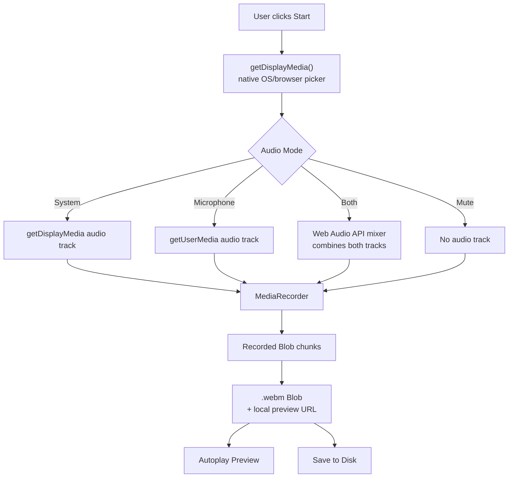

<div align="center">

# 🎥 StudioRecorder

**A modern, browser-based screen recorder — no installs, no plugins, no backend.**

Record your entire screen, a specific window, or a browser tab, with full control over audio, straight from the browser.

<p>
  
  
  
  
  
  
</p>

`<em>`📸 Add a screenshot or GIF of the app here — this is the first thing visitors see, and it does more to earn a star than any paragraph below it.`</em>`

</div>

---

## Table of Contents

- [About](#-about)
- [Features](#-features)
- [Tech Stack](#-tech-stack)
- [Architecture](#-architecture)
- [Project Structure](#-project-structure)
- [Getting Started](#-getting-started)
- [Configuration](#-configuration)
- [Security](#-security)
- [How to Contribute](#-how-to-contribute)
- [What&#39;s Next](#️-whats-next)
- [License](#-license)
- [Acknowledgements](#-acknowledgements)
- [Author](#-author)

---

## 📖 About

**StudioRecorder** is a screen recording web app that runs entirely in the browser — there's no desktop install, no browser extension, and no account required. It's built on standard Web APIs (`getDisplayMedia`, `MediaRecorder`, Web Audio API), so recordings are captured, processed, and saved locally on the user's own machine.

The goal is a **Loom-style recording experience** — pick a screen, window, or tab, control audio precisely, and get a clean, reviewable clip in seconds — without shipping any of that footage to a server.

An Electron-based desktop companion app is in progress, reusing this same codebase, to unlock capabilities the browser sandbox doesn't allow (see [What&#39;s Next](#️-whats-next)).

<br>

## ✨ Features

|                                         |                                                                                                        |
| --------------------------------------- | ------------------------------------------------------------------------------------------------------ |
| 🖥️**Flexible source selection** | Record the entire screen, a specific window, or a single browser tab using the browser's native picker |
| ⏯️**Full playback controls**    | Start, Pause, Resume, and Stop — with a live, accurate recording timer                                |
| 🔊**Configurable audio**          | Choose System Audio, Microphone, both mixed together, or fully muted                                   |
| 💾**Instant local save**          | Recordings save as `.webm` with an autoplay preview immediately after stopping                       |
| ⚙️**Recording preferences**     | Toggle 60 FPS capture, a 3-second countdown, and cursor visibility                                     |
| 🎨**Polished dark UI**            | Glassmorphic, premium interface built with Tailwind CSS                                                |
| ⚡**Zero backend**                | Everything runs client-side — no server, no database, no signup                                       |

<br>

## 🧰 Tech Stack

| Layer                      | Technology                                                                                |
| -------------------------- | ----------------------------------------------------------------------------------------- |
| **UI Framework**     | React 19 + TypeScript                                                                     |
| **Build Tool**       | Vite                                                                                      |
| **Styling**          | Tailwind CSS                                                                              |
| **State Management** | Zustand                                                                                   |
| **UI Primitives**    | Base UI (`Select`, `DropdownMenu`)                                                    |
| **Icons**            | react-icons                                                                               |
| **Recording Engine** | Native Web APIs —`getDisplayMedia`, `getUserMedia`, `MediaRecorder`, Web Audio API |

> Built entirely on standard browser APIs — no third-party recording SDK, no paid service, no vendor lock-in.

<br>

## 🏗️ Architecture

StudioRecorder has no server-side component. All capture, encoding, and playback happen inside the user's browser tab.



**State flow** is split into two layers on purpose:

- **Zustand store** (`recoderStore.ts`, `settingStore.ts`) — holds only serializable, UI-facing state (`status`, `elapsed`, `selectedSource`, preference toggles). Components subscribe to this reactively.
- **Recorder engine** (`recorderEngine.ts`) — an imperative, non-React module holding the actual `MediaStream` / `MediaRecorder` objects, since these aren't meaningfully serializable and shouldn't live inside reactive state.

This separation keeps stream lifecycle management (track cleanup, audio mixing, timers) isolated from render logic, and makes the engine independently testable by mocking `navigator.mediaDevices`.

<br>

## 📦 Project Structure

```
src/
├── engine/
│   └── recorderEngine.ts     # Core recording logic — start/pause/stop, audio mixing
├── store/
│   ├── recoderStore.ts       # Recording state — status, elapsed time, selected source
│   └── settingStore.ts       # User preferences — FPS, countdown, cursor visibility
├── components/
│   ├── VideoComponent.tsx    # Main preview + control dock
│   ├── SelectDisplay.tsx     # Source selection trigger and status badge
│   ├── AudioSettings.tsx     # Audio mode dropdown
│   ├── Settings.tsx          # Recording preferences dropdown
│   └── TopBar.tsx            # Application header
└── App.tsx                   # Root component
```

<br>

## 🚀 Getting Started

### Prerequisites

- Node.js 19 or higher
- npm

### Clone and install

```bash
git clone https://github.com/SASakhare/Screen-Recording-Web-Application.git
cd Screen-Recording-Web-Application
npm install
```

### Run in development

```bash
npm run dev
```

Open **[http://localhost:5173](http://localhost:5173)**. Screen capture APIs work on `localhost` without HTTPS during development.

### Build for production

```bash
npm run build
```

Type-checks the project and produces an optimized static build in `dist/`.

### Preview the production build

```bash
npm run preview
```

### Deploy

StudioRecorder is a fully static site — deploy `dist/` to any static host:

| Host                       | Setup                                                                                        |
| -------------------------- | -------------------------------------------------------------------------------------------- |
| **Vercel**           | Run `vercel` in the project root — Vite is auto-detected                                  |
| **Netlify**          | Build command:`npm run build` · Publish directory: `dist`                               |
| **Cloudflare Pages** | Same configuration as Netlify                                                                |
| **GitHub Pages**     | Build, then run `gh-pages -d dist` · Set `base` in `vite.config.ts` to your repo name |

> ⚠️ **HTTPS is required in production.** `getDisplayMedia` is blocked on plain HTTP outside of `localhost`. Every host above provides HTTPS by default.

<br>

## ⚙️ Configuration

No environment variables or external services are required to run this project — it works out of the box.

If you extend the app (e.g. add cloud upload, analytics, or an API key for a future integration), Vite requires client-exposed variables to be prefixed `VITE_`:

```bash
# .env.local (never commit this file)
VITE_SOME_API_KEY=your-key-here
```

Reference it in code via `import.meta.env.VITE_SOME_API_KEY`. Make sure `.env.local` is listed in `.gitignore`.

<br>

## 🔒 Security

- **No data leaves the browser.** Recordings are held in memory as Blobs and saved directly to the user's local disk — nothing is uploaded anywhere by default.
- **No credentials or API keys are required** for the current feature set, so there's nothing sensitive to leak in this codebase today.
- If you add a backend or third-party service later, keep secrets in environment variables (never hard-code or commit them), and validate/sanitize anything before it touches the DOM to avoid XSS.
- Recording APIs (`getDisplayMedia`) only function over **HTTPS** or `localhost` by browser design — this is a built-in security boundary, not something to bypass.

<br>

## 🔊 Known Browser Limitations

These are constraints of the Screen Capture API itself, not bugs in this application:

| Limitation                       | Explanation                                                                                                                                                                                         |
| -------------------------------- | --------------------------------------------------------------------------------------------------------------------------------------------------------------------------------------------------- |
| **System audio**           | Reliable only when sharing a**browser tab** with "Share audio" enabled. Support for entire-screen audio varies by OS, and individual windows never include system audio.                      |
| **Cursor visibility**      | Partly governed by the OS/browser's own screen picker — JavaScript cannot fully guarantee this.                                                                                                    |
| **Highlight mouse clicks** | Not possible for arbitrary captured windows or screens from a web page, since browsers sandbox mouse-event visibility to the page itself. This becomes fully achievable in the planned desktop app. |

<br>

## 🤝 How to Contribute?

This project is still early-stage, so contribution guidelines are intentionally simple:

1. **Fork** the repository
2. **Create a branch** for your change: `git checkout -b feature/your-feature`
3. **Make your changes**, keeping commits focused and readable
4. **Test locally** with `npm run dev` and `npm run build` before opening a PR
5. **Open a pull request** describing what changed and why

For anything larger than a small fix, please open an issue first so we can discuss the approach before you invest time in it.

<br>

## 🗺️ What's Next?

- [ ] Electron-based desktop application, reusing this React codebase as the renderer
- [ ] Native pre-recording source picker with window/screen thumbnails (`desktopCapturer`)
- [ ] Native "Save As" dialog for direct filesystem saving
- [ ] Global mouse-click highlighting via `uiohook-napi`
- [ ] Reliable, OS-level cursor visibility control
- [ ] Local recordings library with rename/delete
- [ ] Optional MP4 export (via `ffmpeg.wasm` or a bundled `ffmpeg` binary in the desktop build)

<br>

## 📄 License

Released under the [MIT License](LICENSE). You're free to use, modify, and distribute this project, provided the original license is included.

<br>

## 🙏 Acknowledgements

- [Base UI](https://base-ui.com/) — accessible, unstyled UI primitives
- [Zustand](https://github.com/pmndrs/zustand) — minimal state management
- [react-icons](https://react-icons.github.io/react-icons/) — icon library
- [Tailwind CSS](https://tailwindcss.com/) — utility-first styling
- The Web Platform itself — `MediaRecorder`, `getDisplayMedia`, and the Web Audio API make this entire project possible without any paid recording infrastructure

<br>

## 👤 Author

**SASakhare**

- GitHub: [@SASakhare](https://github.com/SASakhare)
- Repository: [Screen-Recording-Web-Application](https://github.com/SASakhare/Screen-Recording-Web-Application)

Questions, ideas, or bug reports are welcome via [GitHub Issues](https://github.com/SASakhare/Screen-Recording-Web-Application/issues).

---

<div align="center">
  <sub>Built with React, TypeScript, and the modern Web Platform.</sub>
</div>
